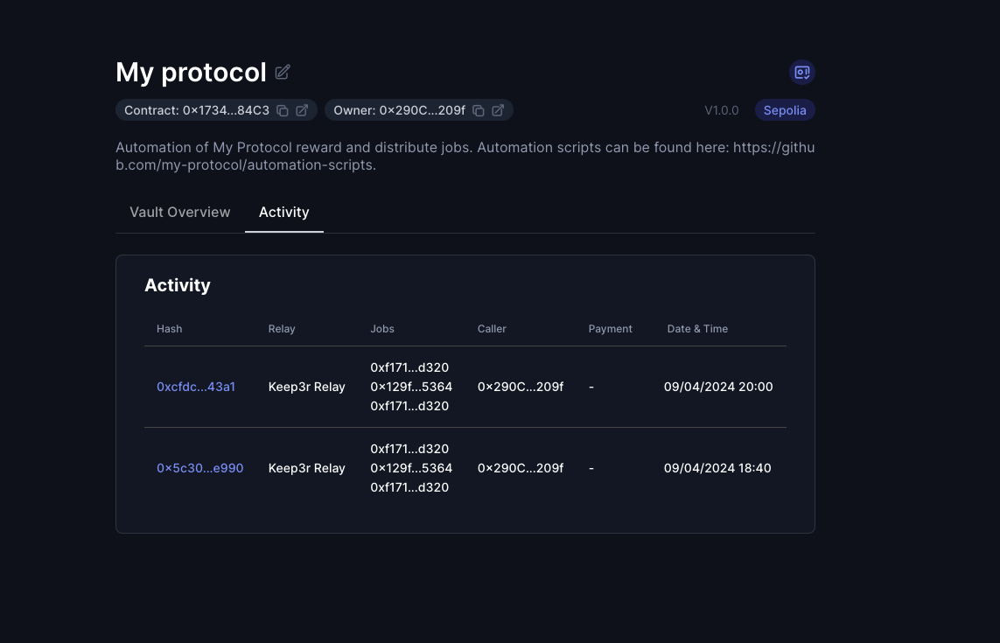

# Enable the Keep3rRelay on your Vault

> 🚧 Prerequisite: Please ensure you have completed the [Automation Vault setup](./automation_vault.md) before proceeding. For this relay, the selected chain must be Ethereum Sepolia.

The Keep3r Relay allows you to connect the Keep3r Network to an array of automation networks within xKeeper. The Keep3r Network currently provides an incentive of 120% of gas costs to keepers. For in-depth information about the Keep3r Network, please consult their [documentation](https://docs.keep3r.network/).

Moreover, the Keep3r Relay introduces an opportunity for job owners to leverage Keep3r Liquidity Provider Tokens (kLPs) for their tasks. These tokens, minted to liquidity providers within the network's pools, accrue KP3R credits over time, which can then be utilized for automation payments. The process is detailed further in the [Credit Mining Docs](https://docs.keep3r.network/tokenomics/job-payment-mechanisms/credit-mining).

## Step 1: Add the relay in your vault

Inside your vault, find and click "Add New Relay," then choose Keep3r Relay from the list.

In the Callers section of the window that appears, activate the "Allow any caller" option to permit any address to execute your job. Remember that only valid keepers will be able to run your job.

Then, in the Jobs section, provide your job's specifics. For this tutorial, we'll use a sample job available on all testnets:

> Job Address: `0x129f5C4Adf38a1860e54DE46970653465A605364`
>
> Selectors to allow:
>
> - `work (0x322e9f04)`

Additionally, for this relay's operation, it's crucial to authorize the `isKeeper` and `worked` functions from Keep3r v2 for executing payments:

> Job Address: `0xf171B63F97018ADff9Bb15F065c6B6CDA378d320 (Keep3rV2)`
>
> Selectors to allow:
>
> - `isKeeper (0x6ba42aaa)`
> - `worked (0x5feeb794)`

Continue by confirming the transaction.

<video controls width="1280">
  <source src="../../media/how-to/keep3r_relay/setup.mp4" type="video/mp4">
  <source src="../../media/how-to/keep3r_relay/setup.webm" type="video/webm">
  Your browser does not support the video tag.
</video>

## Step 2: Register your Automation Vault as a Keep3r Job

Open [keep3r.network](https://keep3r.network/) in your web browser, connect your wallet, and click on "Register Job" using your Automation Vault's address.

<video controls width="1280">
  <source src="../../media/how-to/keep3r_relay/register.mp4" type="video/mp4">
  <source src="../../media/how-to/keep3r_relay/register.webm" type="video/webm">
  Your browser does not support the video tag.
</video>

## Step 3: Acquire kLPs

Since kLPs are backed by WETH and KP3R, acquiring these underlying tokens is a prerequisite for minting kLPs.

- **To obtain WETH:** Utilize the [WETH deposit function](https://sepolia.etherscan.io/token/0xfff9976782d46cc05630d1f6ebab18b2324d6b14#writeContract#F5) to convert 0.01 ETH.
- **To acquire KP3R:** Use the [KP3R mint function](https://sepolia.etherscan.io/token/0x80b4327021946ff962d570c808b6aac47224aef1#writeContract#F9) to mint 100,000 KP3R (`100000000000000000000000`).

Afterward, navigate to your job on [keep3r.network](https://keep3r.network/) and mint kLPs with the KP3R and WETH you've acquired.

<video controls width="1280">
  <source src="../../media/how-to/keep3r_relay/mint-klps.mp4" type="video/mp4">
  <source src="../../media/how-to/keep3r_relay/mint-klps.webm" type="video/webm">
  Your browser does not support the video tag.
</video>

## Step 4: Deposit kLPs into your vault

Access your job on [keep3r.network](https://keep3r.network/) and in the "Add liquidity" section, enter the amount of previously minted kLPs. Proceed by selecting "Add liquidity to job" and confirming the transaction.

This will commence the automatic generation of KP3R credits. Please note, it may take up to an hour to accumulate sufficient credits to commence your job.

<video controls width="1280">
  <source src="../../media/how-to/keep3r_relay/add-klps.mp4" type="video/mp4">
  <source src="../../media/how-to/keep3r_relay/add-klps.webm" type="video/webm">
  Your browser does not support the video tag.
</video>

## Step 5: Work your job for the first time

While only validated keepers can execute tasks, testnet testing simplifies the keeper registration process.

Visit [keep3r.network](https://keep3r.network/), connect your wallet, and select "Bond". Confirm the transaction, without the need of adding KP3R, effectively validating your keeper status.

While this process is typically automated, we'll manually trigger the job via Etherscan for demonstration purposes. Visit the [Keep3rRelay in Etherscan](https://sepolia.etherscan.io/address/0x1bc8FC8D130666d8fC37fCA41F436fDC1F822c1E#writeContract#F1) and execute the `exec` function with the specified parameters.

Let's gather the needed information:

#### `_automationVault`

Your vault's address.

#### `_execData`

This encapsulates the encoded function signature of your job and its parameters. A typical `_execData` example is as follows:

````json
[{ "job": "<JOB_ADDRESS>", "jobData": "<JOB_DATA>" }]

Continue using the testnet sample job address: `0x129f5C4Adf38a1860e54DE46970653465A605364`.

To generate the job data, we will use [chisel](https://book.getfoundry.sh/chisel/):

```bash
> chisel
> bytes32(abi.encodeWithSignature("work()"))

Type: bytes32
└ Data: 0x322e9f0400000000000000000000000000000000000000000000000000000000
````

For alternative methods to generate `_execData`, refer to [Relay exec data](./exec_data.md).

<video controls width="1280">
  <source src="../../media/how-to/keep3r_relay/work.mp4" type="video/mp4">
  <source src="../../media/how-to/keep3r_relay/work.webm" type="video/webm">
  Your browser does not support the video tag.
</video>

## Step 6: Verify execution

After the first work transaction is included onchain, you will be able to find its details under the Activity tab if your vault.


